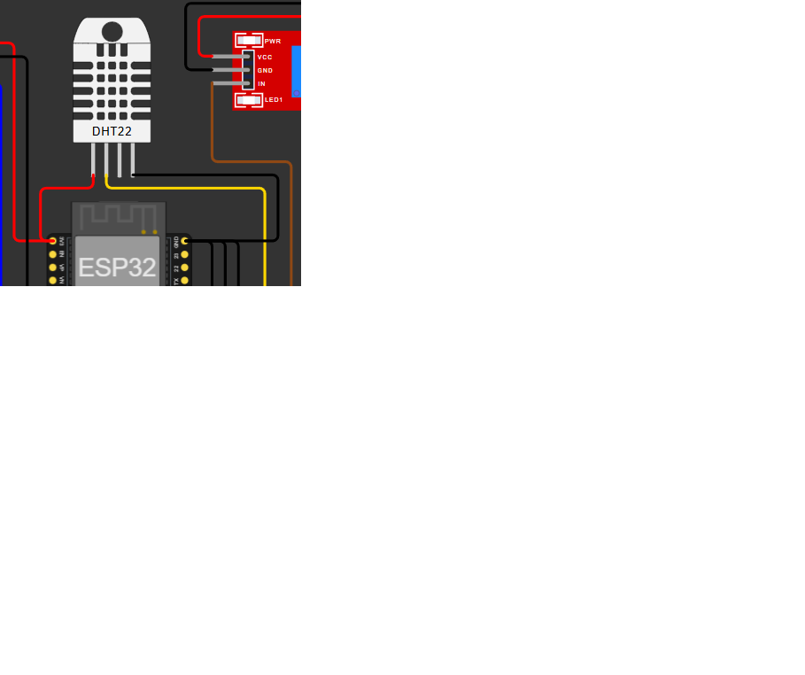
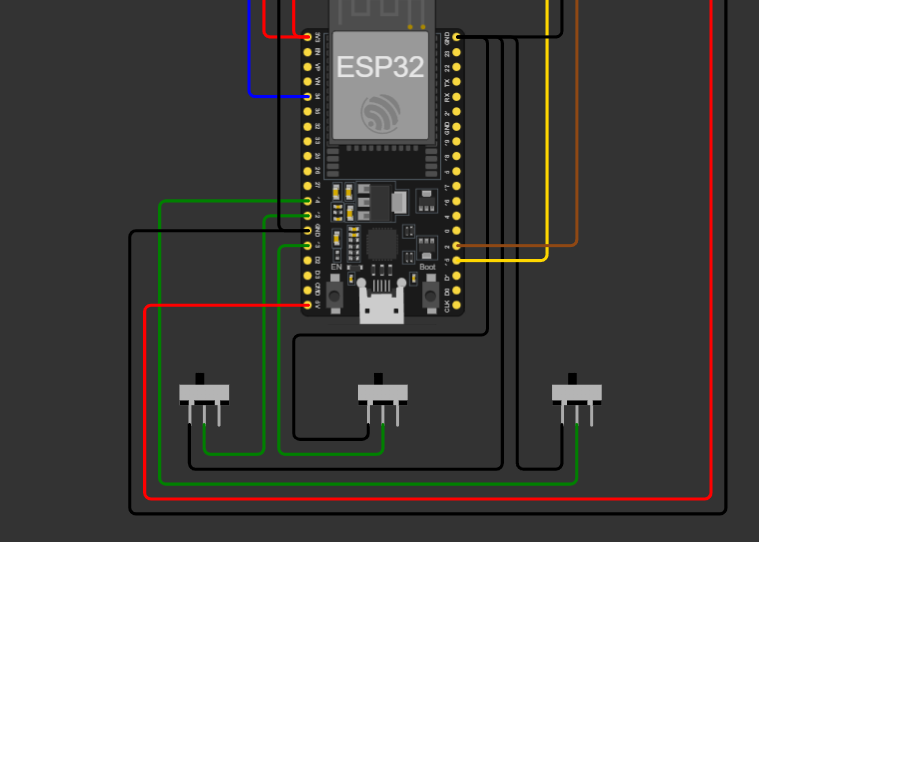

# FIAP - Faculdade de Informática e Administração Paulista

<p align="center">
<a href= "https://www.fiap.com.br/"></a>
</p>

<br>

# FarmTech Solutions — Fase 4: Previsão Inteligente na Agricultura

## FarmTech Solutions

## 👨‍🎓 Integrantes:
- <a href="https://www.linkedin.com/company/inova-fusca">Leandro Tenorio da Silva — RM572083</a>
- <a href="https://www.linkedin.com/company/inova-fusca">Nicolas Xavier Costa — RM570336</a>
- <a href="https://www.linkedin.com/company/inova-fusca">Diego Brega — RM572085</a>
- <a href="https://www.linkedin.com/company/inova-fusca">Pedro Henrique Lima Schneider — RM573999</a>
- <a href="https://www.linkedin.com/company/inova-fusca">João Pedro Bessa — RM570160</a>

## 👩‍🏫 Professores:
### Tutor(a)
- <a href="https://www.linkedin.com/company/inova-fusca">Lucas Gomes Moreira</a>
### Coordenador(a)
- <a href="https://www.linkedin.com/company/inova-fusca">André Godoi Chiovato</a>

## 📜 Descrição

A **Fase 4** do projeto **FarmTech Solutions** marca a aplicação direta de **Inteligência
Artificial** sobre os dados agrícolas coletados, estruturados e armazenados nas fases
anteriores. O objetivo é transformar dados em conhecimento, usando **aprendizado de máquina
supervisionado (regressão) com Scikit-Learn** para gerar previsões e insights relevantes
sobre o campo — como a relação entre umidade, pH e produtividade, e o impacto das ações de
irrigação e fertilização no rendimento final das culturas.

O protótipo de **Assistente Agrícola Inteligente** entregue nesta fase:

- **Modela um banco de dados SQL** (SQLite) capaz de armazenar os dados dos sensores reais
  (ESP32) ou simulados (Wokwi), com ingestão por *upsert* e atualização automática.
- **Treina modelos de regressão** (Linear Múltipla, Polinomial e Random Forest) para prever
  variáveis críticas do campo: **rendimento esperado**, **volume de irrigação**, **umidade do
  solo** e **pH**, avaliados com **MAE, MSE, RMSE e R²** + validação cruzada (5 folds).
- **Sugere ações futuras de irrigação e manejo** (em Python) a partir das previsões,
  incluindo a necessidade de fertilização (N, P, K) com base nas faixas adequadas do solo.
- **Apresenta tudo em um dashboard interativo em Streamlit**, com métricas de desempenho,
  gráficos de correlação, tendências de produtividade e previsões geradas em tempo real,
  facilitando a interpretação por gestores agrícolas.

A solução integra **sensores IoT → banco de dados → modelos de Machine Learning**, dando
início à **Agricultura Cognitiva**, em que a tecnologia aprende com os dados do campo para
otimizar resultados de forma mais eficiente e sustentável.

### Funcionalidades do dashboard (5 abas)

- **Monitoramento IoT:** umidade, pH, nutrientes (NPK) e irrigação a partir do CSV dos
  sensores, com sugestões baseadas no clima (OpenWeather).
- **Banco de Dados:** ingestão/atualização do banco SQLite e visualização das tabelas
  `leituras_sensores` e `dados_agricolas`.
- **Machine Learning:** métricas MAE/MSE/RMSE/R², validação cruzada, gráfico previsto vs real,
  resíduos e importância das variáveis.
- **Correlação e Tendências:** matriz de correlação e tendências de produtividade (média móvel).
- **Previsão Interativa:** sliders das condições do campo geram previsões em tempo real e
  recomendações de manejo.

## 📁 Estrutura de pastas

Dentre os arquivos e pastas presentes na raiz do projeto, definem-se:

- <b>.github</b>: arquivos de configuração específicos do GitHub.

- <b>assets</b>: elementos não-estruturados, como imagens (logo FIAP, prints do circuito ESP32
  no Wokwi e do banco de dados Oracle).

- <b>config</b>: arquivos de configuração do projeto — `requirements.txt` (dependências
  Python), `platformio.ini`, `wokwi.toml`, `diagram.json` e `libraries.txt` (build/simulação
  do ESP32) e `.env.example` (modelo de variáveis de ambiente).

- <b>document</b>: documentos do projeto — `DOCUMENTACAO_PROJETO.md`, `ROTEIRO_VIDEO.md` e o
  `ai_project_document_fiap.md`. Na subpasta `other`, documentos complementares.

- <b>scripts</b>: scripts auxiliares para tarefas específicas do projeto.

- <b>src</b>: todo o código-fonte do projeto. Como os scripts Python e os dados (`.csv`) são
  interdependentes (os caminhos são relativos), eles ficam juntos nesta pasta:
  - `dashboard_farmtech.py` — dashboard Streamlit (integra IoT, banco e ML).
  - `modelo_ml.py` — pipeline Scikit-Learn (treino, avaliação, previsão e recomendações).
  - `gerar_dataset_ml.py` — geração do dataset agrícola para treino.
  - `banco_dados.py` — banco SQL (SQLite) com ingestão e atualização automática.
  - `coletar_sensores_csv.py`, `gerar_csv_wokwi_cli.py` — coleta dos dados do ESP32/Wokwi.
  - `importar_csv_oracle.py` — importação dos dados para Oracle (Ir Além).
  - `appid.py` — integração com a API de clima (OpenWeather).
  - `sketch.ino` — firmware do ESP32 (C++).
  - `dados_agricolas.csv`, `dados_sensores_wokwi.csv` — dados usados pelo dashboard/ML.

- <b>README.md</b>: este guia geral do projeto.

## 🔧 Como executar o código

### Pré-requisitos

- **Python 3.10+** (testado com 3.14).
- Bibliotecas Python: `streamlit`, `scikit-learn`, `pandas`, `numpy`, `plotly`, `requests`
  (todas em `config/requirements.txt`).
- (Opcional) Conta na **OpenWeather** para o clima em tempo real.
- (Opcional) **PlatformIO / Wokwi CLI** para compilar/simular o ESP32.

### 1. Clonar e instalar dependências

```bash
git clone https://github.com/TenorioDevfullStack/cursotiaor-pbl-fase4.git
cd cursotiaor-pbl-fase4
python -m venv .venv
# Windows (PowerShell): .venv\Scripts\Activate.ps1
# Linux/Mac:            source .venv/bin/activate
pip install -r config/requirements.txt
```

### 2. Gerar o dataset e treinar/avaliar o modelo (PARTE 2)

> Os comandos do pipeline Python devem ser executados **dentro da pasta `src/`**, pois os
> scripts usam caminhos relativos para os arquivos `.csv` e para o banco.

```bash
cd src
python gerar_dataset_ml.py --amostras 500
python modelo_ml.py --alvo rendimento --modelo random_forest
```

Métricas disponíveis: **MAE, MSE, RMSE e R²** + validação cruzada (5 folds).
Modelos: `linear`, `polinomial`, `random_forest`. Alvos: `rendimento`,
`volume_irrigacao`, `umidade_solo`, `ph`.

### 3. Banco de dados SQL — ingestão e atualização automática (IR ALÉM 1)

```bash
cd src
python banco_dados.py ingerir                 # cria farmtech.db e popula com os CSVs
python banco_dados.py resumo                   # resumo dos dados armazenados
python banco_dados.py observar --intervalo 5   # re-ingere automaticamente quando os CSVs mudam
```

### 4. Dashboard Streamlit (PARTE 1 e IR ALÉM 2)

```bash
cd src
streamlit run dashboard_farmtech.py
```

(Opcional) Clima em tempo real — defina a chave da OpenWeather (nunca é exibida na tela):

```bash
# PowerShell
$env:OPENWEATHER_API_KEY="sua_chave_openweather"
```

Ou crie um arquivo `.env` dentro de `src/` seguindo `config/.env.example`. Sem a chave, o
dashboard usa a coluna `chuva_prevista` do CSV.

### 5. (Opcional) Compilar/simular o ESP32

A simulação online roda direto no Wokwi (link abaixo). Para a build local com PlatformIO,
execute a partir da pasta `config/` (o `platformio.ini` já aponta `src_dir = ../src`):

```bash
cd config
python -m platformio run
```

## 🗃 Histórico de lançamentos

* 1.0.0 - 20/06/2026
    * Fase 4: pipeline de Machine Learning (Scikit-Learn), banco SQL (SQLite) com ingestão
      automática e dashboard Streamlit com previsões interativas.
    * Reorganização do repositório no padrão de pastas FIAP.
* 0.3.0 - Fase 3
    * Banco de dados relacional (Oracle) e importação dos dados dos sensores.
* 0.2.0 - Fase 2
    * Sistema de fertirrigação com ESP32 (C++) e integração com API de clima (Python).

## 🔗 Links do Projeto

- **Vídeo de Demonstração:** [https://youtu.be/mPI2g-Q3YFI](https://youtu.be/mPI2g-Q3YFI)
- **Simulador Wokwi:** [https://wokwi.com/projects/461289392904235009](https://wokwi.com/projects/461289392904235009)

## 📸 Imagens do Projeto

### Circuito de Sensores no Wokwi

| Sensor | Imagem |
| --- | --- |
| DHT22 (umidade/temperatura) |  |
| LDR (pH via luz) |  |
| Relé (bomba de irrigação) |  |
| Botões (nutrientes NPK) |  |

### Banco de Dados


## 📋 Licença

<p xmlns:cc="http://creativecommons.org/ns#" xmlns:dct="http://purl.org/dc/terms/"><a property="dct:title" rel="cc:attributionURL" href="https://github.com/agodoi/template">MODELO GIT FIAP</a> por <a rel="cc:attributionURL dct:creator" property="cc:attributionName" href="https://fiap.com.br">Fiap</a> está licenciado sobre <a href="http://creativecommons.org/licenses/by/4.0/?ref=chooser-v1" target="_blank" rel="license noopener noreferrer" style="display:inline-block;">Attribution 4.0 International</a>.</p>
